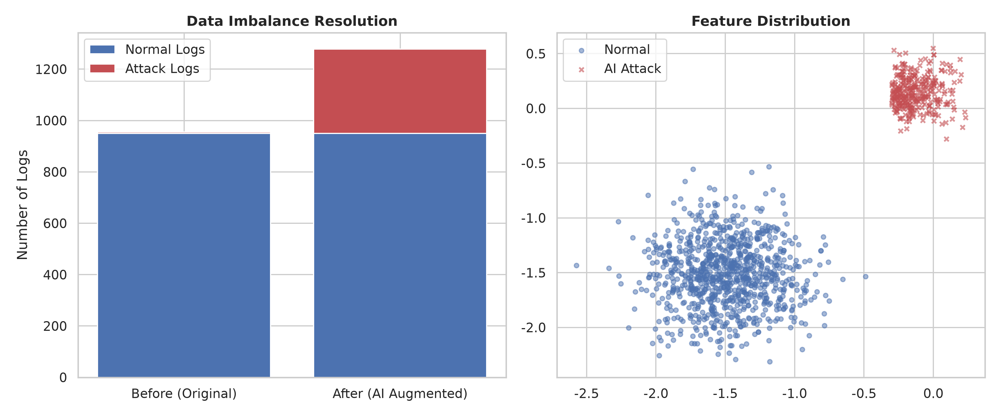

# ai-security-anomaly-detection
PyTorch-based network security anomaly detection system utilizing virtual attack log augmentation to resolve data imbalance.

# AI 기반 실시간 보안 위협 및 이상 징후(Anomaly) 탐지 시스템

'정상 로그에 비해 부족한 공격 로그(데이터 불균형)' 문제를 해결하기 위해, AI 가상 데이터 증강 기법을 도입하고 PyTorch로 실시간 위협을 탐지해 보는 보안 개인 프로젝트입니다.

## 1. 프로젝트 개요
 **문제 상황**: 실제 서버나 네트워크 환경에서는 정상적인 시스템 이용 로그가 99% 이상이고, 실제 해킹이나 공격 로그는 1%도 되지 않습니다. 데이터가 이렇게 불균형하면 딥러닝 모델이 공격을 제대로 학습하지 못합니다.
- **해결 아이디어**: 
  1. 가상의 공격 시나리오 데이터를 만들어내는 '생성기(VirtualAttackGenerator)'를 설계하여 부족한 공격 데이터를 증강시켰습니다.
  2. 증강된 데이터를 바탕으로 시스템 로그가 유입되었을 때 실시간으로 위험도를 계산하고 경고를 띄워주는 파이프라인을 시뮬레이션했습니다.

## 2. 데이터 준비 및 불균형 해소 전략

실제 보안 도메인의 특성을 반영하여 정상 데이터와 AI 생성 데이터를 결합했습니다.
- **정상 데이터 (950건)**: 원점 주변에서 멀어진 안정적인 시스템 이용 패턴 영역으로 생성했습니다.
- **공격 데이터 (최초 5건 ➔ AI 증강 후 약 300~400건)**: 'VirtualAttackGenerator'를 통해 생성된 가상 공격 로그 중, 첫 번째 피처가 -0.3보다 큰 데이터만 남기는 '도메인 필터링 정제 규칙'을 적용해 노이즈를 걷어내고 유의미한 공격 패턴만 학습에 활용했습니다.

💡 **핵심 포인트**
무작정 가상 데이터를 섞는 것이 아니라, 정상 데이터와 공격 데이터의 비율이 1:1에 가깝게 맞춰지도록 인프라를 설계했습니다. 이를 통해 모델이 한쪽 클래스에 편향되지 않고 공격 징후를 예리하게 잡아내도록 유도했습니다.

## 3. 기술 스택 및 모델 구조
- **사용 언어**: Python 3.12 (Jupyter Notebook)
- **사용한 라이브러리**: PyTorch, Matplotlib, Seaborn, NumPy
- **딥러닝 모델 설계**:
  - **입력층**: 5차원의 시스템 로그 벡터 입력
  - **은닉층 1**: Linear (노드 64개) + ReLU + **Dropout(0.3) 적용으로 과적합 방지**
  - **은닉층 2**: Linear (노드 32개) + ReLU
  - **출력층**: Linear (노드 1개) + Sigmoid (0~1 사이의 위험도 스코어 도출)
  - **설정**: Adam 옵티마이저 / BCELoss (이진 크로스 엔트로피 손실 함수)

## 4. 실시간 추론 시뮬레이션 및 배운 점
-**실시간 추론 함수 ('stream_inference')**: 학습된 모델에 임계값(Threshold = 0.7) 필터를 적용했습니다. 위험도가 70%를 넘으면 즉각 시스템에 경고를 발생시킵니다.
- **테스트 결과**:
  - 정상 유입 패턴 테스트 시 위험도가 낮게 측정되어 **정상** 판정
  - 고위험성 가상 위협 로그 유입 시 임계값을 돌파하며 **공격** 판정 및 즉각 경고 활성화
- **배운 점**: 머신러닝/딥러닝을 보안에 적용할 때 가장 까다로운 '데이터 불균형'을 코드로 직접 해결해 보면서, 무작정 모델을 복잡하게 만드는 것보다 학습 데이터의 비율과 정제 과정이 모델의 실무 유효성을 결정짓는다는 것을 깊이 깨달았습니다.

## 5. 확인 방법
- 상단의 'security_anomaly_detection.ipynb' 파일을 클릭하시면전체 실행 결과를 바로 웹에서 확인하실 수 있습니다.
